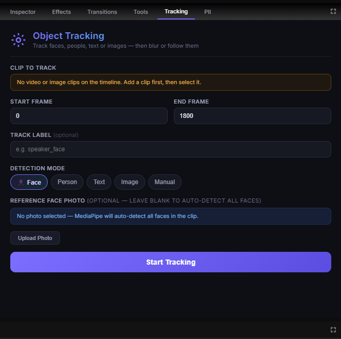
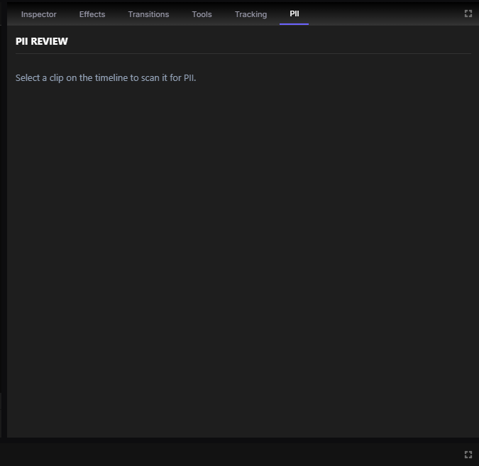
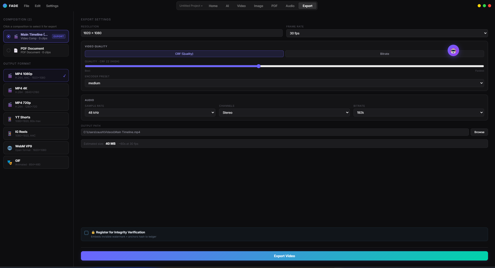
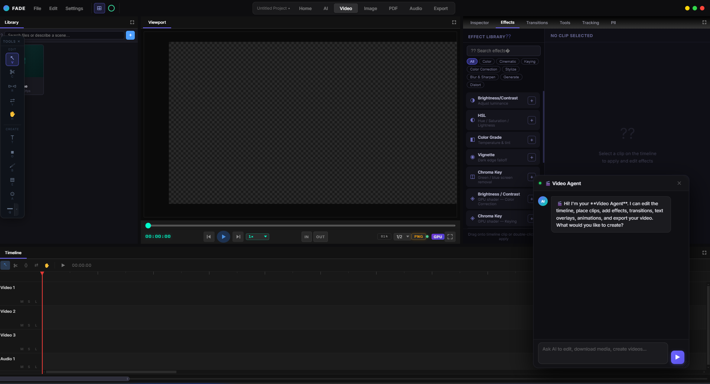
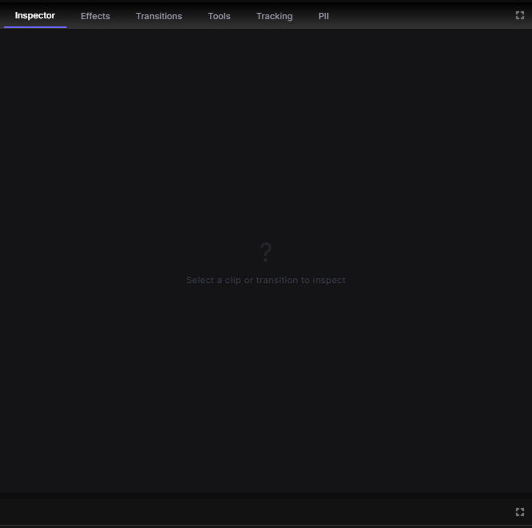
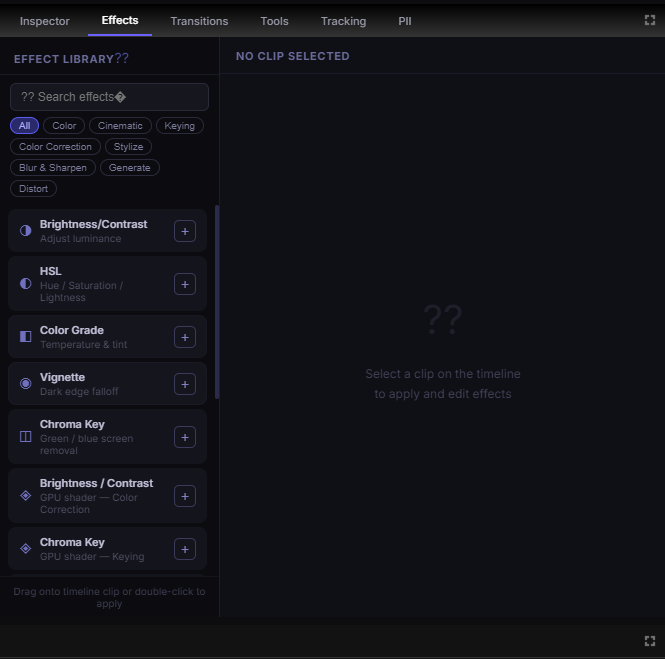
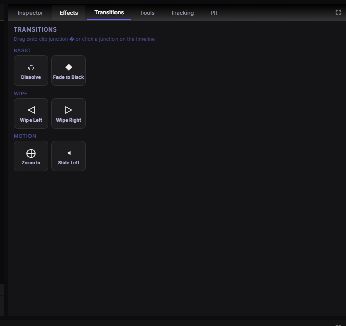
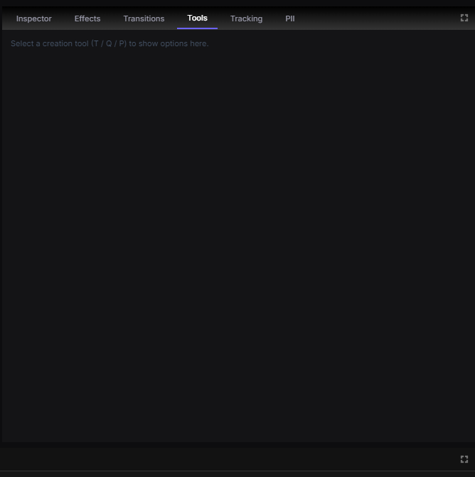
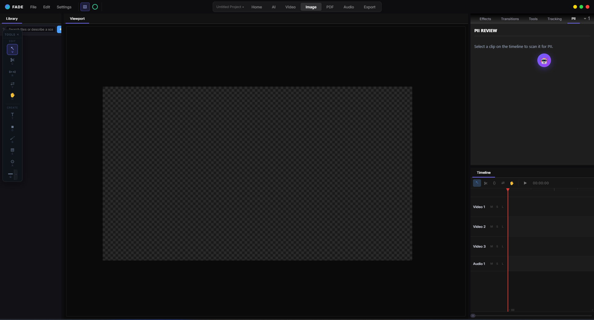
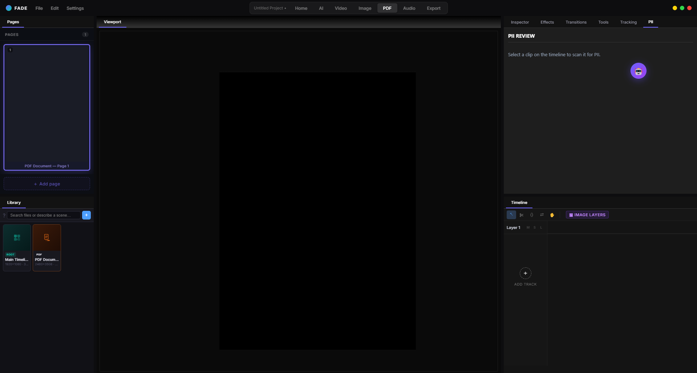

# Fade (Echo) — AI-Powered Media Editor with Built-in Privacy Protection


---

# ⬇️ DON'T WANT TO BUILD IT? DOWNLOAD IT HERE AND JUST USE IT

## 👉 **[GOOGLE DRIVE — DOWNLOAD FADE FOR WINDOWS](https://drive.google.com/drive/folders/10WzWDuEOPObGmxKkgonT9sPAAYzh8YUw?usp=sharing)** 👈

**https://drive.google.com/drive/folders/10WzWDuEOPObGmxKkgonT9sPAAYzh8YUw?usp=sharing**

No Python, Node.js or compiler needed. Download the folder, extract it, double-click **`Fade.exe`**.

---

## Table of Contents

1. [How to use it (quick start)](#1-how-to-use-it-quick-start)
2. [What each tab does](#2-what-each-tab-does)
3. [Compositions: Video, Image, WebComp and PDF](#3-compositions-video-image-webcomp-and-pdf)
4. [Cyber-security and privacy features](#4-cyber-security-and-privacy-features)
5. [Tab-by-tab tour with screenshots](#5-tab-by-tab-tour-with-screenshots)
6. [The AI agent](#6-the-ai-agent)
7. [For developers: architecture](#7-for-developers-architecture)
8. [For developers: build from source](#8-for-developers-build-from-source)
9. [Project structure](#9-project-structure)
10. [Known limitations](#10-known-limitations)

---

## 1. How to use it (quick start)

### Install

1. Open the **[Google Drive folder](https://drive.google.com/drive/folders/10WzWDuEOPObGmxKkgonT9sPAAYzh8YUw?usp=sharing)** and download the build.
2. Extract it anywhere (keep all files together — `Fade.exe` needs the `resources` folder beside it).
3. Double-click **`Fade.exe`**. If Windows SmartScreen appears, click **More info → Run anyway**.
4. A splash screen shows the backend and render engine starting, then the editor opens.

**Requirements:** Windows 10/11 64-bit. A GPU with Vulkan support is used for the live preview;
without one the app falls back to a slower CPU compositor.

### First run

1. Open **Settings** (top-left) and choose an **AI provider** — a local **Ollama** model for fully
   offline use, or paste an API key for OpenAI, Anthropic Claude, Google Gemini, Groq or OpenRouter.
   The editor works without AI; only the chat agent needs a model.
2. Go to the **Video** tab.

### Make your first video

| Step | What to do |
| ---- | ---------- |
| 1. Import | Drag files into the **Library** panel, or click **+**. You can also type a description in the search box to find a scene inside your footage. |
| 2. Place | Drag an asset from the Library onto a track in the **Timeline**. |
| 3. Edit | Use the floating toolbox: Select `V`, Razor `C`, Ripple `R`, Slip `Y`, Pan `H`. Create with Text `T`, Solid `O`, Brush `B`, Eraser `E`, Adjustment `A`, Pen path `P`. |
| 4. Style | Select a clip, then use the right-hand tabs: **Inspector**, **Effects**, **Transitions**. |
| 5. Protect | Use **Tracking** to blur faces, people or text, and **PII** to find and redact sensitive data. |
| 6. Export | Open the **Export** tab, pick a composition and a format, click **Export Video**. |

`Space` plays / pauses, `←` `→` step one frame, `Ctrl+Shift+L` opens the backend log window.

### Or just ask the AI

Click the round AI button to open the agent chat and type what you want, for example:

> *"Create a 30-second awareness video about fake e-challan scams: write the script, generate the
> voiceover, download B-roll, add titles and captions, and blur every face."*

The agent builds a step-by-step plan, runs it, and shows each step's progress in the chat.

---

## 2. What each tab does

| Tab | What it is for |
| --- | -------------- |
| **Home** | Landing page with shortcuts into the other workspaces and quick-start tips. |
| **AI** | AI-first workspace: the Library and a large preview. You describe the result and the agent builds it. |
| **Video** | The full editor: Library, Viewport, multi-track Timeline, and the Inspector / Effects / Transitions / Tools / Tracking / PII panels. |
| **Image** | Layer-based still-image canvas. The same tools and effects, with layers instead of time. |
| **PDF** | Multi-page document builder. Each page is a canvas of layers; exports a PDF. |
| **Audio** | The editing layout with the audio agent: voiceover (text-to-speech), captions from speech, volume and silence removal. |
| **Export** | Choose the composition, format, quality and audio settings, and optionally register the file for integrity verification. |

Every workspace has its own AI agent (Video Agent, Image Agent, Audio Agent, PDF Agent) with its
own chat history, so a conversation in one tab does not leak into another.

---

## 3. Compositions: Video, Image, WebComp and PDF

A **composition** ("comp") is a canvas with its own size, frame rate and layers. A project can hold
many comps, and one comp can be placed inside another as a clip.

### Video composition

- **What it is:** a timeline with video and audio tracks. The project starts with one, the
  **Main Timeline** (1920×1080, 30 fps).
- **Clip types:** video, image, audio, text, shape, solid colour, brush / pen strokes, SVG,
  nested compositions and WebComps.
- **Use it for:** reels, explainers, awareness videos, product demos, podcasts clips.
- **How to use:** Video tab → drag assets to tracks → trim, split and move clips → add effects,
  transitions and keyframe animation → export as MP4 / WebM / GIF.

### Image composition

- **What it is:** a single-frame comp. Tracks become **layers**, like a photo editor.
- **Use it for:** thumbnails, posters, social-media posts, redacted screenshots.
- **How to use:** Image tab → add images, text and shapes as layers → apply effects and masks →
  export as an image.

### WebComp (live HTML composition)

- **What it is:** a clip whose content is a real web page (HTML + CSS + JavaScript) rendered
  frame-accurately. It can be a local animation or a live site.
- **Use it for:** animated lower-thirds, counters and charts, UI mock-ups, particle backgrounds,
  embedding a live website (for example an official helpline page) as an overlay.
- **How to use:** ask the agent (*"add a web overlay of https://cybercrime.gov.in bottom-right for
  6 seconds"* or *"make an animated stat counter"*), or create one from a template. Select the clip
  to edit its files and parameters in the WebComp inspector. Position, size and opacity work like
  any other clip.

### PDF composition

- **What it is:** a document made of pages; each page is its own canvas (A4 at 2480×3508).
- **Use it for:** reports, advisories, one-page explainers, redacted documents.
- **How to use:** PDF tab → **Add page** → place text, images and shapes as layers → export a PDF.

---

## 4. Cyber-security and privacy features

Fade treats privacy as part of editing. Detection and blurring run **on your own machine** — the
backend only listens on `127.0.0.1`.

### 4.1 Object Tracking — find it, follow it, blur it



Pick a clip, a frame range and a detection mode, then press **Start Tracking**.

| Mode | What is detected | How |
| ---- | ---------------- | --- |
| **Face** | Every face in the clip | MediaPipe face detector |
| **Face + reference photo** | Only one specific person | A face embedding from the photo you upload |
| **Person** | Whole bodies | YOLOv8 |
| **Text** | On-screen text (optionally matching a pattern) | OCR |
| **Image** | A logo or object you provide | Template matching |
| **Manual** | A box you draw | Frame-to-frame tracker |

A finished track can **blur** the subject (the blur follows it through the clip) or make another
layer **follow** it.

### 4.2 PII Review — detect and redact sensitive data



Select a clip and the panel scans it for personal and secret data. For images and video, text is
read from the frames with OCR; text files are scanned directly.

| Detected | Examples |
| -------- | -------- |
| Indian identity data | Aadhaar numbers, PAN numbers, phone numbers |
| Contact data | Email addresses; person names when the optional spaCy language model is installed |
| Financial data | Credit-card numbers (checksum-validated) |
| Secrets | Private keys, JWTs, AWS keys, GitHub tokens, bearer tokens, `password=` / `api_key=` values |
| Network data | IPv4 addresses |

You review every finding, switch individual ones off, or add your own boxes. On confirm, Fade
creates a **sanitized copy**, swaps it into the timeline, and marks the original **RESTRICTED** so
it is not used by mistake.

### 4.3 The agent protects privacy for you

You can simply ask, and the agent runs the same tools:

| You say | The agent does |
| ------- | -------------- |
| *"Blur all faces in every clip"* | Detects and tracks every face, then applies a tracked blur |
| *"Blur everyone except this person"* (with a photo) | Uses the reference photo to tell people apart |
| *"Hide the phone number on screen"* | Tracks the matching text and blurs it |
| *"Scan this asset for sensitive data"* | Runs PII detection and lists what it found |
| *"Sanitize it"* | Redacts all detected PII and restricts the original |

### 4.4 Prompt-injection shield

Text hidden inside a file can try to hijack an AI agent ("ignore your instructions and …").
Fade screens for this in three places:

- every message sent to the agent,
- every imported **PDF**,
- every imported **image** (its text is read with OCR first).

Each input is allowed, cleaned (the malicious part is neutralised), or blocked.

### 4.5 Integrity verification — prove a video is the original



Tick **Register for Integrity Verification** before exporting and Fade records four independent
proofs of the file:

| Layer | Survives | What it is |
| ----- | -------- | ---------- |
| SHA-256 hash | Nothing (exact copy only) | Byte-exact fingerprint |
| Merkle tree + ledger anchor | — | Tamper-evident record of the hash (local ledger; an on-chain contract is supported) |
| Perceptual hash | Re-encoding, resizing | Fingerprint of what the video *looks* like |
| Invisible watermark | Platform re-uploads | An ID embedded in the frames (DWT-DCT) |

Checking a file later returns one of: **AUTHENTIC**, **AUTHENTIC_REENCODED**,
**AUTHENTIC_PLATFORM_COPY** or **UNVERIFIED**.

---

## 5. Tab-by-tab tour with screenshots

### Video workspace



| Area | Purpose |
| ---- | ------- |
| **Library** (left) | Imported and downloaded media, plus compositions. The search box also finds scenes by description. |
| **Toolbox** (floating) | Edit tools (Select, Razor, Ripple, Slip, Pan) and create tools (Text, Solid, Brush, Eraser, Adjustment, shapes, Pen). |
| **Viewport** (centre) | GPU preview with transport controls, in/out points, preview resolution and zoom. |
| **Right panel** | Six tabs, described below. |
| **Timeline** (bottom) | Video and audio tracks with mute / solo / lock per track. |
| **Agent chat** | The Video Agent; drag the round AI button to move it. |

### Inspector



Shows the properties of the selected clip or transition: position, scale, rotation, opacity, text
styling, WebComp parameters, and keyframe animation for any property.

### Effects



A searchable effect library with categories (Color, Cinematic, Keying, Color Correction, Stylize,
Blur & Sharpen, Generate, Distort). Drag an effect onto a clip or double-click to apply, then tune
its parameters on the right. Effects are GPU shaders, so the preview updates live.

### Transitions



Dissolve, Fade to Black, Wipe Left / Right, Zoom In and Slide Left. Drag one onto the join between
two clips.

### Tools



Options for the active creation tool — text (`T`), shapes (`Q`), pen (`P`), brush and eraser
settings, and masks.

### Tracking and PII

See [section 4](#4-cyber-security-and-privacy-features) for both panels.

### Image workspace



A still-image canvas. The Timeline panel lists layers instead of time, and the same Effects,
Tools, Tracking and PII panels apply.

### PDF workspace



**Pages** on the left (add, reorder, delete), the page canvas in the centre, and the page's
**image layers** on the right. The Library shows both the main timeline and the PDF document.

### Export workspace


| Setting | Options |
| ------- | ------- |
| Composition | Any video comp or PDF document in the project |
| Format | MP4 1080p / 4K / 720p, YouTube Shorts, Instagram Reels, WebM VP9, GIF |
| Video quality | CRF (quality) or fixed bitrate, plus encoder preset |
| Audio | Sample rate, channels, bitrate |
| Output | File path, estimated size |
| Integrity | Optional registration (see 4.5) |

---

## 6. The AI agent

- **Understands goals, not just commands.** A request is routed to one of four paths: a
  ready-made **skill** (educational video, short reel, product demo, podcast clip, cinematic
  B-roll, motion graphic, social post, software intro), a **custom plan** built for your request,
  a **single edit**, or a **question** about the project.
- **Your steps win.** If you write your own numbered steps, the agent follows them instead of a
  template.
- **Shows its work.** Each plan step appears in the chat with its status. If a step fails, the
  finished steps are kept — reply **continue** to retry from that step.
- **What it can do:** generate voiceover (Kokoro, runs locally), transcribe and caption (Whisper),
  download video, images and music, generate images, build WebComps, place and animate clips,
  apply effects and transitions, track and blur, scan for PII, and export.
- **External control:** other AI clients can drive Fade through its MCP endpoint (`/mcp-remote`).

---

## 7. For developers: architecture

Fade is three programs that cooperate: an **Electron** shell, a **C++ render engine** loaded
inside it, and a **Python** backend running beside it.

```
┌──────────────────────── Fade.exe — Electron MAIN process (Node.js) ────────────────────────┐
│ electron/main.ts                                                                           │
│  • creates the splash, editor and log windows                                              │
│  • spawns the Python backend and reads its port from stdout                                │
│  • require("render_engine.node")  — the C++ engine runs INSIDE this process                │
│  • hosts off-screen Chromium windows for WebComps                                          │
└───────┬───────────────────────────────┬───────────────────────────────────┬────────────────┘
        │ ① IPC (contextBridge)         │ ② N-API calls + thread-safe       │ spawn / kill
        │                               │    callbacks                      │
┌───────▼───────────────┐   ┌───────────▼─────────────────┐   ┌─────────────▼────────────────┐
│ React UI              │   │ C++20 render engine         │   │ Python backend               │
│ (renderer process)    │   │ Vulkan + Skia + FFmpeg      │   │ FastAPI + Uvicorn            │
│ Vite · React · TS     │   │ render_engine.node          │   │ HTTP  127.0.0.1:PORT         │
└───────┬───────────────┘   └───────────┬─────────────────┘   │ TCP   127.0.0.1:PORT+1       │
        │                               │ ③ TCP: "frame N?" → frame description (JSON)        │
        │                               └──────────────────────────────────►│                │
        │ ④ HTTP REST + Server-Sent Events                                   │                │
        └───────────────────────────────────────────────────────────────────►└────────────────┘
```

### 7.1 Who owns what

| Component | Owns | Does not own |
| --------- | ---- | ------------ |
| **Python backend** | The project: timeline, clips, comps, keyframes, undo history, library, jobs, AI | Pixels on screen |
| **C++ engine** | Decoding and drawing frames on the GPU | Any project state — it asks Python what a frame contains |
| **React UI** | Interaction and layout | State — it reads it from Python and repaints on events |
| **Electron main** | Processes, windows, files, and the bridge between the other three | Editing logic |

That split is the key idea: **Python is the single source of truth, C++ is a stateless painter.**

### 7.2 Link ① — UI ↔ Electron main (IPC)

`electron/preload.ts` exposes a small `window.electronAPI` through `contextBridge`
(`contextIsolation` on, `nodeIntegration` off). Channels are grouped by prefix:

| Prefix | Examples | Purpose |
| ------ | -------- | ------- |
| `window:` | `minimize`, `maximize`, `close` | Frameless window controls |
| `dialog:` / `shell:` / `app:` | `dialog:open`, `dialog:save` | Native file dialogs and paths |
| `backend:` | `backend:port`, `backend:get-port` | Tells the UI which port Python chose |
| `render:` | `seek`, `play`, `pause`, `resize`, `set-preview-scale`, `get-buffer`, `get-stats`, `frame-ready` | Drives the native engine |
| `export:` | `start`, `cancel`, `progress`, `capture-image`, `capture-pdf` | Export orchestration |
| `webcomp:` | `create`, `capture-frame`, `prefetch`, `update-params`, `push-to-native` | WebComp windows |
| `layout:` | `load`, `save`, `reset` | Panel layout persistence |

### 7.3 Link ② — Electron main ↔ C++ (N-API)

The renderer is compiled with **cmake-js** into `render_engine.node`, a native addon written
against **Node-API (N-API v8)** with `node-addon-api`. Electron loads it with a plain `require()`,
so calls are direct function calls in the same process — no sockets, no serialisation.

Exports of `renderer/src/napi/RenderEngineAddon.cpp`:

| Function | Purpose |
| -------- | ------- |
| `initialize(width, height, fps, effectsDir, pythonPort)` | Creates the Vulkan device, Skia context and compositor |
| `seekFrame(n)` / `play()` / `pause()` / `isPlaying()` | Transport |
| `setFrameReadyCallback(fn)` | Registers the "frame N is ready" callback |
| `getSharedBuffer()` | Returns the latest RGBA frame as a `Buffer` |
| `getStats()` | Current width, height, fps, buffer size |
| `setPreviewScale(scale)` | Preview resolution (the editor previews at half size by default) |
| `startExport(config, progressFn)` / `cancelExport()` | Full-resolution render to FFmpeg |
| `pushWebCompFrame(id, frame, rgba, w, h)` | Hands a captured web page frame to the compositor |

**Threads.** The engine renders on its own C++ thread, but JavaScript may only be called on the
Node thread. The addon uses a `Napi::ThreadSafeFunction`: the render thread queues
"frame N ready" and Node later runs the JS callback. Only the frame *number* crosses threads; the
pixels are fetched on demand.

**A frame's journey to the screen:**

```
C++ play thread         renders frame N on the GPU, reads RGBA back into its buffer
   │  ThreadSafeFunction
Electron main           frame-ready(N)  →  webContents.send('render:frame-ready', N)
   │  IPC
React ViewportWidget    invoke('render:get-buffer')  →  getSharedBuffer()  →  canvas.putImageData()
```

If the addon cannot load (no Vulkan, missing file), the app falls back to a Python/Skia compositor.

### 7.4 Link ③ — C++ ↔ Python (frame descriptions over TCP)

The engine holds no timeline. For every frame it asks Python what to draw, over a persistent
local TCP socket on **HTTP port + 1** (`TCP_NODELAY`, loopback only):

```
C++  →  Python :   4 bytes  little-endian uint32   frame number
Python →  C++  :   4 bytes  little-endian uint32   payload length
                   N bytes  JSON                    frame description
```

The JSON lists every visible clip for that frame with all animation already evaluated: source
file and source frame, transform, opacity, effects and their uniform values, text / shape / pen /
SVG data, transitions, and nested compositions. C++ parses it into a `FrameDescriptor`
(`napi/FrameDescriptor.hpp`) and draws it.

Python answers from a small prefetch cache: after serving frame N it immediately computes N+1 in a
thread pool, so sequential playback is normally a cache hit. A binary protocol was chosen over
HTTP here because the per-request overhead mattered at 30–60 requests per second.

### 7.5 Link ④ — UI ↔ Python (REST + events)

- **Commands** are plain HTTP, for example `POST /timeline/add-clip` or `POST /jobs/tts-generate`.
- **Changes** come back as **Server-Sent Events** with a scope (`timeline`, `library`, `job`,
  `comp-resized`, …). The UI refetches only what changed. This is also how the UI stays correct
  when the *agent* edits the project.
- **AI chat** is an SSE stream of tokens, tool calls, tool results and plan-step events.
- **Long jobs** (TTS, downloads, generation) return a job id. `GET /jobs/{id}/wait` holds the
  request open and returns the moment the job finishes, so nothing polls.

### 7.6 Inside the C++ engine (`renderer/src`)

| Folder | Contents |
| ------ | -------- |
| `napi/` | The N-API surface and the frame-description parser |
| `HeadlessCompositor.*` | Orchestrator: play loop, TCP client, render, read-back |
| `gpu/vulkan/` | Device and queues, VMA-backed buffers and textures, command pools, and the Skia–Vulkan context |
| `rendering/` | Text, shape, pen and SVG drawing; the render graph and its passes (upload, draw, effect, mask); the effect registry |
| `video/` | FFmpeg decoders: hardware (D3D11VA) with a software fallback |
| `engine/` | Decode scheduler, decoder pool, frame cache and thread pool — frames are decoded ahead of the playhead |

**Vulkan** provides the device, memory and command submission. **Skia** draws on top of that same
Vulkan device, so video frames, text, vector shapes and effects are composited in one GPU pass
without copying to the CPU in between. **Effects** are SkSL shaders in
`backend/timeline/effects/sksl/`; the same shader files are used by the C++ engine and the Python
fallback so both render identically.

### 7.7 Inside the Python backend (`backend/`)

| Area | Contents |
| ---- | -------- |
| `main.py` | App start-up, router mounts, the TCP frame server |
| `routers/` | REST endpoints: project, library, timeline, clips, comps, effects, transitions, animation, audio, jobs, export, search, PII, PDF export |
| `engine/`, `timeline/`, `animation/`, `history/` | The project model, keyframes and expressions, undo / redo command stack |
| `ai/` | Request router, skill and plan executor (checkpointed in SQLite), the LangGraph tool-calling agent, tool definitions, MCP server, prompt shield |
| `tracking/`, `pii/`, `integrity/` | The security features of section 4 |
| `worker/` | A sandboxed worker process for indexing, transcription and waveforms |
| `tools/` | Downloaders (yt-dlp, image search) and generators (TTS, image) |

The agent's tools are thin wrappers that call the backend's **own HTTP API** — the agent edits the
project exactly the way the UI does, so both stay in sync and every agent action is undoable.

### 7.8 WebComp pipeline

Each WebComp gets a hidden, sandboxed, **off-screen Chromium window** in the Electron main process
(`electron/webComp/webCompRenderer.ts`). For frame N the page's clock is set to N / fps, the page
is captured, and the pixels are cached and handed to the compositor with `pushWebCompFrame`, where
they are composited like any other layer. Captures are serialised so a frame can never be confused
with its neighbour.

### 7.9 Export pipeline

```
Electron main   re-initialises the engine at full resolution
                pre-renders every WebComp frame and pushes it to the engine
C++ engine      for each frame: ask Python → render on GPU → write raw RGBA into an FFmpeg pipe
FFmpeg          encodes (NVENC / AMF / Media Foundation / x264, whichever is available)
Electron main   muxes the mixed audio, reports progress to the UI
Python          optional: integrity registration of the finished file
```

Still images are captured from the engine's buffer as PNG; PDF export captures each page the same
way and the backend assembles the document.

---

## 8. For developers: build from source

### Prerequisites

- Windows 10/11 x64, **Node.js 20+**, **Python 3.12**
- For the C++ engine only: **Visual Studio 2022** (Desktop C++), **CMake 3.20+**, **Vulkan SDK**

### Run in development

```bash
npm install
python -m venv .venv
.venv\Scripts\python.exe -m pip install -r requirements.txt
npm run dev
```

`npm run dev` starts Vite, compiles the Electron main process, and launches the app, which starts
the Python backend from `.venv`.

### Build the app

| Command | Rebuilds | Time |
| ------- | -------- | ---- |
| `npm run build:full` | Everything → `dist-app\win-unpacked\Fade.exe` | ~9 min |
| `npm run build:full -- -Native` | Everything, recompiling the C++ engine first | longer |
| `npm run build:backend-only` | The Python backend, then copies only changed files into the build | ~8 min |
| `npm run build:ui-only` | The React UI and Electron code, copied into the build | ~10 s |
| `npm run hotfix` | Nothing — copies changed backend `.py` files into the build | seconds |
| `npm run build:native` | Only `render_engine.node` | — |

The full build runs PyInstaller, Vite, electron-builder, then `scripts/post_build_patch.ps1`,
which copies native libraries and models and **verifies about 45 required files** (FFmpeg DLLs,
the MSVC runtime beside the engine, TTS and face-detection libraries, models).

### Things to know

- The build runs PyInstaller as `python -m PyInstaller` from this repo's `.venv`. Do not call
  `.venv\Scripts\pyinstaller.exe` directly if the venv was ever moved or copied — that launcher
  remembers its original path.
- The backend ships as plain `.py` files inside the build, which is why `npm run hotfix` works.
  `backend/main.py` is the exception: it is compiled into `backend.exe`.
- `renderer/CMakeLists.txt` contains absolute paths to a local Vulkan helper source tree and FFmpeg
  binaries. Adjust them before running `build:native` on another machine.
- **Your `.env` is copied into the build.** Remove API keys from it before sharing a build.
- Optional features are included only if their package is installed in `.venv` when you build.
  The build prints a warning for each one that is missing.

### Configuration (`.env`)

```env
FADE_AI_PROVIDER=ollama      # ollama | openai | claude | gemini | groq | ...
FADE_AI_MODEL=               # leave empty to auto-select
OPENAI_API_KEY=
ANTHROPIC_API_KEY=
GOOGLE_API_KEY=
GROQ_API_KEY=
```

Everything here can also be set from **Settings** inside the app.

---

## 9. Project structure

```
Fade/
├── electron/                Electron main process
│   ├── main.ts              windows, IPC, backend process, native engine, export
│   ├── preload.ts           the API exposed to the UI
│   └── webComp/             off-screen WebComp renderer
├── src/                     React UI
│   ├── App.tsx              top-level tabs and workspaces
│   └── workspaces/          video, image, pdf, export, library, timeline, viewport,
│                            inspector, tools, tracking, pii, AI chat
├── backend/                 Python backend (FastAPI)
│   ├── main.py              start-up, routers, TCP frame server
│   ├── routers/             REST API
│   ├── ai/                  router, planner, skills, agent, tools, prompt shield
│   ├── tracking/ pii/ integrity/      security features
│   ├── timeline/ animation/ engine/   project model
│   └── worker/ tools/                 background work, downloaders, generators
├── renderer/                C++ render engine
│   ├── CMakeLists.txt
│   ├── src/                 napi, gpu/vulkan, rendering, video, engine
│   └── deps/                Skia, FFmpeg, VMA, headers
├── AIModels/                bundled models (TTS, speech, detection, OCR)
├── scripts/                 build, post-build patch, hotfix
├── docs/screenshots/        images used in this README
└── backend.spec             PyInstaller configuration
```

---

## 10. Known limitations

- **Windows only.** The engine uses Direct3D hardware decoding and Windows sockets.
- **"CUDA … is missing" in the log is harmless.** Without NVIDIA CUDA libraries the AI models run
  on the CPU.
- **A model is needed for the agent.** Editing, tracking, PII detection, TTS and captions work
  offline; the chat agent needs Ollama or an API key.
- **Background removal** is only present in builds made with the `rembg` package installed.
- **Some models download on first use** if they are not already in `AIModels`.
- **After closing the app, a `Fade.exe` process can occasionally linger** and keep the install
  folder locked. Sign out or restart Windows if a build or update reports locked files.

---

*Built for Smart India Hackathon (SIH).*
